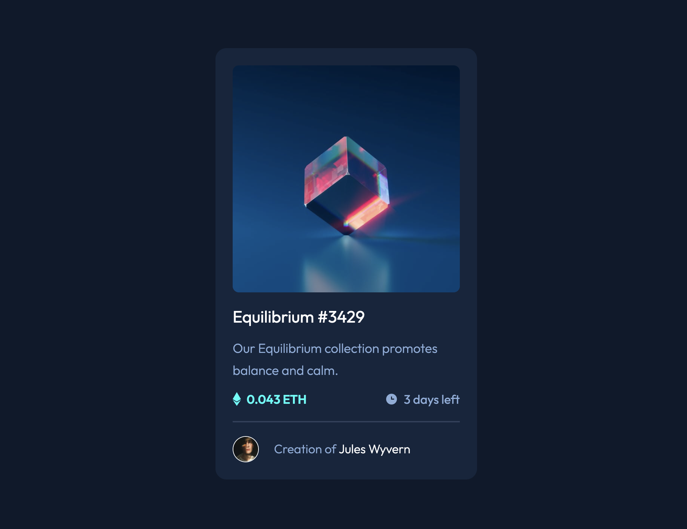

# Frontend Mentor - NFT preview card component solution by Derick McMillian

This is a solution to the [NFT preview card component challenge on Frontend Mentor](https://www.frontendmentor.io/challenges/nft-preview-card-component-SbdUL_w0U). Frontend Mentor challenges help you improve your coding skills by building realistic projects.

## Table of contents

- [Overview](#overview)
  - [The challenge](#the-challenge)
  - [Screenshot](#screenshot)
  - [Links](#links)
- [My process](#my-process)
  - [Built with](#built-with)
  - [What I learned](#what-i-learned)
  - [Continued development](#continued-development)
  - [Useful resources](#useful-resources)
- [Author](#author)
- [Acknowledgments](#acknowledgments)

## Overview

### The challenge

Users should be able to:

- View the optimal layout depending on their device's screen size
- See hover states for interactive elements

### Screenshot

### Links

- Solution URL: [GitHub Link](https://github.com/derick4L/nft-card-challenge)
- Live Site URL: [Site Link](https://nft-card-challenge-derick.netlify.app/)

## My process

### Built with

- Semantic HTML5 markup
- CSS custom properties
- Flexbox
- CSS Grid

### What I learned

I'd say this project was pretty cut and dry. However, I did have bit of trouble implementing the hover state for the product image. What kept me stumped was the opacity. I applied opacity on hover and it kept changing all the elements under my image instead of just the image. To remedy this, I added a z-index to the image and it's hover effect. This allowed me to hover over the image and its opacity doesnt change the elements underneath.

### Useful resources

- [Color Picker by Google](https://g.co/kgs/GS2poQ) - In order to follow the style guide closely was possible. I used Color Picker widget, plugged in the color values given to me, and aliased the values in my global css.
- [W3 Schools 
 tag overview](https://www.w3schools.com/tags/tag_hr.asp) - I worked with these tags before but I wanted to style it further. I used this site to review it's properties to see what I could style.
- [HTML Favicon Tutorial](https://careerkarma.com/blog/html-favicon/) - I needed a refresher to get the favicon up and running. This site helped me in a little under 2 mins.

**Note: Delete this note and replace the list above with resources that helped you during the challenge. These could come in handy for anyone viewing your solution or for yourself when you look back on this project in the future.**

## Author

- Website - [Derick McMillian](https://www.thederickmcmillian.com)
- Frontend Mentor - [@derick4L](https://www.frontendmentor.io/profile/derick4L)
- Twitter - [@\_derick_m](https://twitter.com/_derick_m)
